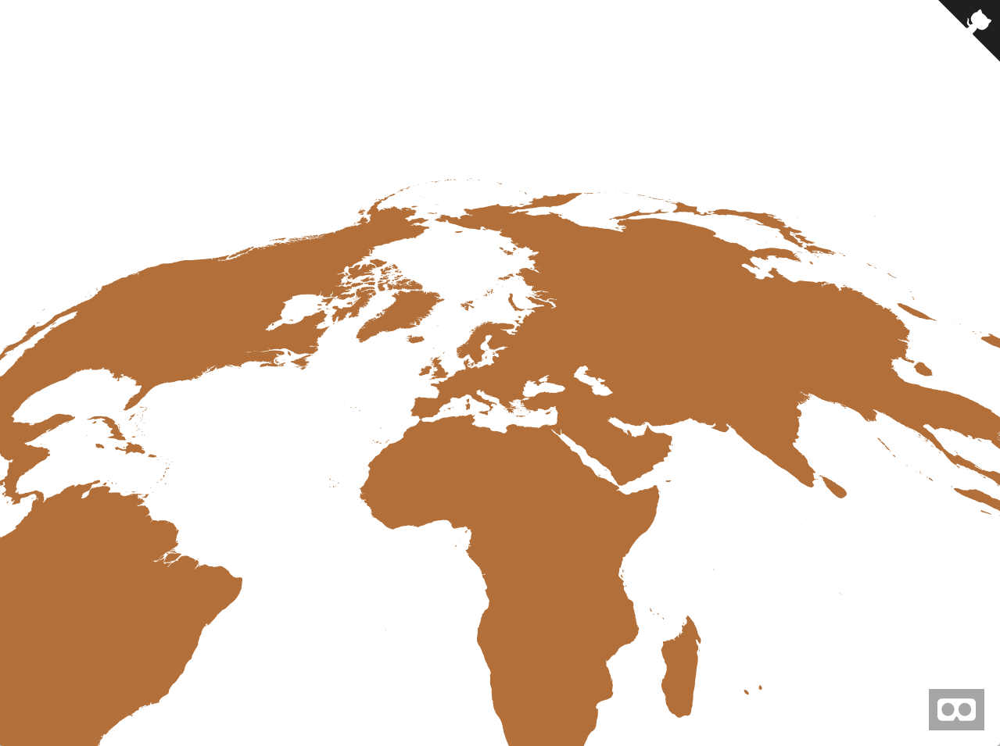
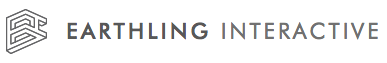

## aframe-geo-projection-component

[](https://npmjs.org/package/aframe-geo-projection-component)
[](https://npmjs.org/package/aframe-geo-projection-component)
[](https://travis-ci.org/EarthlingInteractive/aframe-geo-projection-component)

An [A-Frame](https://aframe.io) component for creating maps in [WebVR](https://webvr.info/) using [d3-geo](https://github.com/d3/d3-geo) projections.



### API

| Property | Description | Default Value |
| -------- | ----------- | ------------- |
| src      | path to a GeoJson or Topojson asset | None              |
| srcType | type of the src asset; supported types are: "geojson" and "topojson" | geojson |
| topologyObject | Only for TopoJSON: Specifies the TopoJSON object to use. If empty, then the first one will be used.| |
| width      | width of the plane on which to project the map | 1              |
| height      | height of the plane on which to project the map | 1              |
| projection | the name of a projection from d3-geo or d3-geo-projection | geoIdentity |
| meshType | how to render the map; supported types are: "line" for line segments, "shape" for flat shapes, and "extrude" for shapes extruded into 3D | line |
| isCCW | Determines how shapes and holes are identified.  By default solid shapes are defined clockwise (CW) and holes are defined counterclockwise (CCW). If isCCW is set to true, then those are flipped. | false |

Note that it is also required to set a material on the component.  For a meshType of "shape", you can use the standard (default) shader
or the flat shader.

#### LineBasicMaterial shader API
For a meshType of "line", this library provides a custom shader for a LineBasicMaterial.  To use it,
set the shader to `linebasic`
```html
<a-entity material="shader: linebasic; color: red;" ...></a-entity>
```

The following configurable properties are provided:

| Property | Description | Default Value |
| -------- | ----------- | ------------- |
| blending | Which blending to use when displaying objects with this material. | THREE.NormalBlending |
| color | Color of the material. | #000 |
| depthTest | Whether to have depth test enabled when rendering this material. | true |
| depthFunc | Which depth function to use. | THREE.LessEqualDepth |
| depthWrite | Whether rendering this material has any effect on the depth buffer. | true |
| fog | Whether the material is affected by fog. | false |
| linewidth | Controls line thickness. | 1 |
| linecap | Define appearance of line ends. Possible values are 'butt', 'round' and 'square'. | round |
| linejoin | Define appearance of line joints. Possible values are 'round', 'bevel' and 'miter'. | round |
| opacity | Float in the range of 0.0 - 1.0 indicating how transparent the material is. A value of 0.0 indicates fully transparent, 1.0 is fully opaque. | 1 |
| side | Defines which side of faces will be rendered - front, back or both. | THREE.FrontSide |
| transparent | Defines whether this material is transparent. This has an effect on rendering as transparent objects need special treatment and are rendered after non-transparent objects. When set to true, the extent to which the material is transparent is controlled by setting its opacity property.| false |
| vertexColors | Defines whether vertex coloring is used. | THREE.NoColors |
| visible | Defines whether this material is visible. | true |

#### isCCW and its relation to geojson and topojson

The isCCW flag is important when rendering topoJSON vs. geoJSON.  For
features smaller than a hemisphere, topoJSON uses clockwise shapes while
geoJSON uses counterclockwise shapes.  For features larger than a
hemisphere (such as oceans or some continents), the opposite is true.

To summarize:
* If you're showing a world map using geojson, set isCCW to false.
* If you're showing a world map using topojson, set isCCW to true.
* If you're showing a country using geojson, set isCCW to true.
* If you're showing a country using topojson, set isCCW to false.

See https://github.com/d3/d3-geo for a discussion of winding order conventions.

### Installation

#### Browser

Install and use by directly including the [browser files](dist):

```html
<head>
  <title>My A-Frame Scene</title>
  <script src="https://aframe.io/releases/0.7.1/aframe.min.js"></script>
  <script src="https://unpkg.com/aframe-geo-projection-component/dist/aframe-geo-projection-component.min.js"></script>
</head>

<body>
  <a-scene>
    <a-assets>
    <a-asset-item id="json-world" src="https://d2ad6b4ur7yvpq.cloudfront.net/naturalearth-3.3.0/ne_50m_land.geojson" />
    </a-assets>

    <a-entity geo-projection="
                src: #json-world;
                meshType: line;
                projection: geoStereographic;
                height: 10;
                width: 20;
              "
              material="shader: linebasic; color: red;"
    ></a-entity>
  </a-scene>
</body>
```

#### npm

Install via npm:

```bash
npm install aframe-geo-projection-component
```

Then require and use.

```js
require('aframe');
require('aframe-geo-projection-component');
```

## Development

To set up the project for development:

1. Ensure that node >= v8 is installed on your system
1. `git clone` the repository
1. run `npm install` in the root of the project directory

Once the project dependencies are installed, you can:
* run `npm test` to run the tests
* run `npm start` to load up the examples in a browser.  The content is served via a [budo](https://github.com/mattdesl/budo) dev server so any changes in the code will cause the web page to update automatically.
* run `npm run lint` to check the code for coding standard violations
* run `npm run ghpages` to update the github pages branch with the latest examples gallery
* run `npm publish` to publish the latest version of the package to npm

## Credits

Created by:

[](https://earthlinginteractive.com/)
