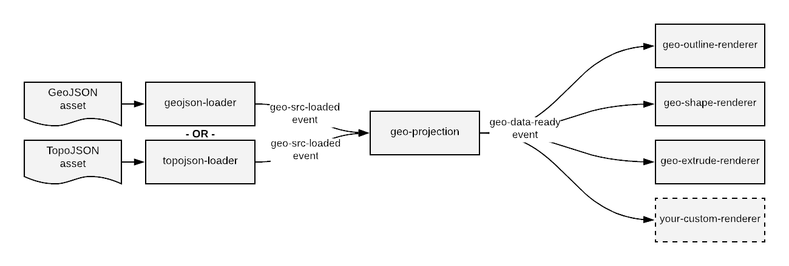

## aframe-geo-projection-component

[](https://npmjs.org/package/aframe-geo-projection-component)
[](https://npmjs.org/package/aframe-geo-projection-component)
[](https://travis-ci.org/EarthlingInteractive/aframe-geo-projection-component)
[](https://coveralls.io/github/EarthlingInteractive/aframe-geo-projection-component?branch=master)

A set of [A-Frame](https://aframe.io) components for creating maps in [WebVR](https://webvr.info/)
using [d3-geo](https://github.com/d3/d3-geo) projections.

[](https://earthlinginteractive.github.io/aframe-geo-projection-component/)

### Components

The components in this library each handle a different responsibility, starting with loading a file of map data and
progressing through to projecting that data and then rendering it.  The components communicate through events. The diagram
below shows an overview of the communication flow. Usually, all components are attached to the same entity.


#### geojson-loader component

This component loads a GeoJSON file and informs any listeners when the file has finished loading.

##### Component Schema
| Property | Description | Default Value |
| -------- | ----------- | ------------- |
| src      | path to a GeoJSON asset | None; required |

##### Events
| Type | Description | default object |
| -------- | ----------- | ------------- |
| geo-src-loaded | Fired when the GeoJSON specified in the src attribute has finished loading. | `geoJson`: the GeoJSON data as a JavaScript object |

#### topojson-loader component

This component loads a TopoJSON file, converts it to GeoJSON, and informs any listeners when the file has finished loading.

##### Component Schema
| Property | Description | Default Value |
| -------- | ----------- | ------------- |
| src      | path to a TopoJSON asset | None; required |
| topologyObject | Specifies the TopoJSON topology object to convert to GeoJSON. If empty, then the first one will be used.| |

##### Events
| Type | Description | default object |
| -------- | ----------- | ------------- |
| geo-src-loaded | Fired when the TopoJSON specified in the src attribute has finished loading. | `geoJson`: the GeoJSON data as a JavaScript object |

#### geo-projection component

This component projects GeoJSON data onto a plane in VR world coordinates.
It does not render anything graphically; that responsibility is handled by the renderer components.

##### Component Schema
| Property | Description | Default Value |
| -------- | ----------- | ------------- |
| width      | width of the plane on which to project the map | 1              |
| height      | height of the plane on which to project the map | 1              |
| projection | the name of a projection from d3-geo or d3-geo-projection | geoIdentity |
| isCCW | Determines how shapes and holes are identified.  By default solid shapes are defined clockwise (CW) and holes are defined counterclockwise (CCW). If isCCW is set to true, then those are flipped. | false |

##### Events
| Type | Description | default object |
| -------- | ----------- | ------------- |
| geo-data-ready | Fired when the GeoJSON data has been projected and is ready for rendering |  |

#### geo-outline-renderer component

This component renders projected GeoJSON data as outlines.  This is the most robust of the three renderers provided, so
switch to this if you're having trouble seeing your map.

##### Component Schema
| Property | Description | Default Value |
| -------- | ----------- | ------------- |
| color | If this attribute is set, then the outlines will be rendered using a THREE.LineBasicMaterial of the specified color; if not, the renderer will use the material of the attached entity.  This allows for specifying custom materials. | None |

#### geo-shape-renderer component

This component renders projected GeoJSON data as flat shapes.  It uses the material attached to the entity it's associated with,
so make sure to set your color there.

##### Component Schema
| Property | Description | Default Value |
| -------- | ----------- | ------------- |
| isCCW | Determines how shapes and holes are identified.  By default solid shapes are defined clockwise (CW) and holes are defined counterclockwise (CCW). If isCCW is set to true, then those are flipped. For most cases, the default is correct. | false |

#### geo-extrude-renderer component

This component renders projected GeoJSON data as extruded shapes. It uses the material attached to the entity it's associated with,
so make sure to set your color there.

##### Component Schema
| Property | Description | Default Value |
| -------- | ----------- | ------------- |
| extrudeAmount | The amount in A-Frame units to extrude the shapes | 1 |
| isCCW | Determines how shapes and holes are identified.  By default solid shapes are defined clockwise (CW) and holes are defined counterclockwise (CCW). If isCCW is set to true, then those are flipped. For most cases, the default is correct. | false |

#### Customization
To build a custom visualization of geo data, the recommended way is to create a custom renderer component responsible for loading any additional data and performing the rendering.  This component should wait for the `geo-data-ready` event before doing its work to avoid race conditions.  The ["U.S. Population by State in 2017" example](./examples/fancy/us-population.html) shows an example of how to build a visualization using a custom component.

### Installation

#### Browser

Install and use by directly including the [browser files](dist):

```html
<head>
  <title>My A-Frame Scene</title>
  <script src="https://aframe.io/releases/0.8.2/aframe.min.js"></script>
  <script src="https://unpkg.com/aframe-geo-projection-component/dist/aframe-geo-projection-component.min.js"></script>
</head>

<body>
  <a-scene>
    <a-assets>
    <a-asset-item id="json-world" src="https://d2ad6b4ur7yvpq.cloudfront.net/naturalearth-3.3.0/ne_50m_land.geojson" />
    </a-assets>

      <a-entity rotation="-90 0 0"
                geojson-loader="src: #json-world;"
                geo-projection="
                  projection: geoStereographic;
                  height: 10;
                  width: 20;"
                geo-outline-renderer="color: red;"
      >
      </a-entity>
  </a-scene>
</body>
```

#### npm

Install via npm:

```bash
npm install aframe-geo-projection-component
```

Then require and use.

```js
require('aframe');
require('aframe-geo-projection-component');
```

## Development

To set up the project for development:

1. Ensure that node >= v8 is installed on your system
1. `git clone` the repository
1. run `npm install` in the root of the project directory

Once the project dependencies are installed, you can:
* run `npm test` to run the tests
* run `npm start` to load up the examples in a browser.  The content is served via a [budo](https://github.com/mattdesl/budo) dev server so any changes in the code will cause the web page to update automatically.
* run `npm run lint` to check the code for coding standard violations
* run `npm run ghpages` to update the github pages branch with the latest examples gallery
* run `npm publish` to publish the latest version of the package to npm

## Credits

Created by:

[](https://earthlinginteractive.com/)
